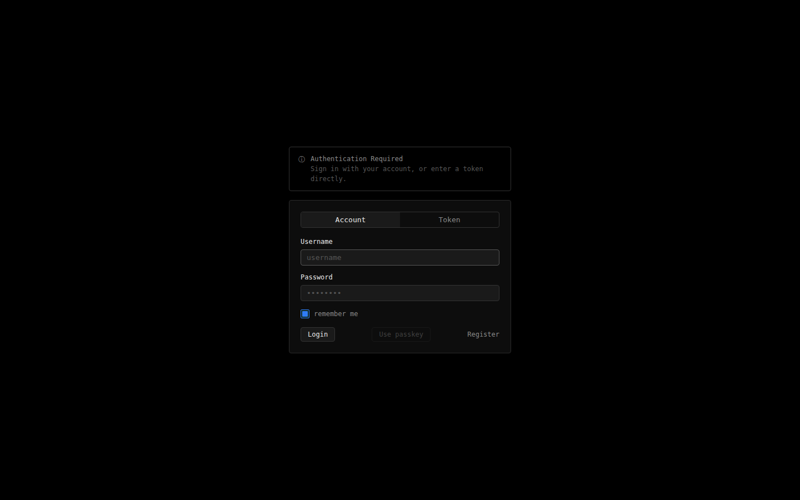
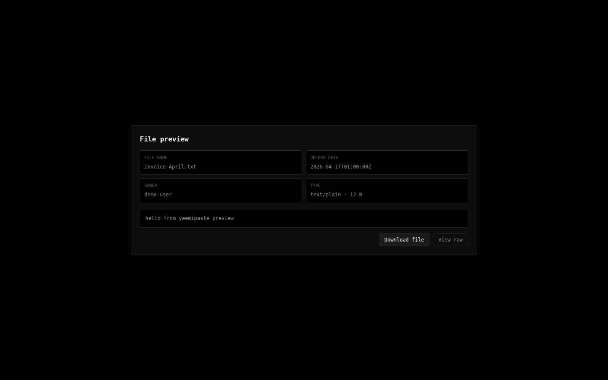
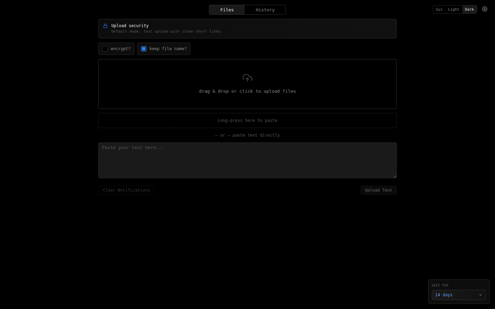

# yaemipaste

> A self-hosted paste and file-sharing stack built on top of **[rustypaste](https://github.com/orhun/rustypaste)**.

If you want the short version: rustypaste handles file storage, serving, and the auth API. This project wraps it with a cleaner UI, token workflows, end-to-end encrypted shares, passkeys, ShareX support, and a proper upload history. You get a full stack without stitching things together manually.

This repository is public-facing and intended for independent deployments.

---

## What's included

| Feature | Notes |
|---------|-------|
| Upload & history | Drag-and-drop or paste. Per-file expiry. Delete from history. |
| E2E encrypted shares | AES-GCM client-side encryption. Key never leaves the browser — it lives in the share URL fragment. |
| Passkeys | Passwordless login via WebAuthn on supported devices and password managers. |
| ShareX config | One-click `.sxcu` download once authenticated. |
| Public preview | Clean preview page for images, video, text, and PDFs shared with anyone. |
| Open-source friendly | All private features are opt-in through env vars. Works without accounts or Turnstile. |

---

## Documentation

For the full reference — environment variables, feature behavior, and troubleshooting — start here:

- [`docs/ENVIRONMENT.md`](docs/ENVIRONMENT.md) — every env var explained
- [`docs/KNOWLEDGEBASE.md`](docs/KNOWLEDGEBASE.md) — edge cases, notes, and gotchas

---

## Install

### Option 1 — One-command installer *(recommended)*

```bash
curl -fsSL "https://example.invalid/install.sh?v=latest" | bash
```

The installer is interactive. It walks you through the full setup and supports:

- full stack install and updates
- first user initialization
- token create and revoke
- service start / stop / restart / status
- safe uninstall with confirmation prompts

You can also run it from a local clone:

```bash
git clone https://github.com/emiliauh/yaemipaste.git
cd yaemipaste
./install.sh
```

---

### Option 2 — Docker Compose *(manual)*

```bash
git clone https://github.com/emiliauh/yaemipaste.git
cd yaemipaste
cp .env.example .env
# edit .env to taste
docker compose up --build -d
```

The UI is exposed on `http://localhost:8080` by default.  
Set `UI_PORT` in `.env` to change the port.

---

## Configuration

Edit `.env` for your deployment. See [`docs/ENVIRONMENT.md`](docs/ENVIRONMENT.md) for a complete variable-by-variable breakdown.

No personal credentials or private keys belong in repository files — everything sensitive is injected through env vars at build time or runtime.

**A few things worth knowing upfront:**

- `VITE_MAX_EXPIRY_DAYS` controls the maximum day-based retention shown in the UI (default: 14).
- To reveal a **Forever** retention option in the selector, hold **Shift** and click the **Keep for** control.
- `VITE_ENABLE_SHAREX=1` enables the ShareX config download for logged-in users.
- Turnstile is fully optional — leave `VITE_TURNSTILE_SITE_KEY` unset and the login form skips the challenge.

---

## Exposing to the web

The typical pattern for a public deployment:

1. Set `UI_PORT` (e.g. `8080`) in your `.env`.
2. Put a reverse proxy in front — Caddy, Nginx, or Traefik all work.
3. Route your public domain to `localhost:${UI_PORT}`.
4. Enable TLS — Let's Encrypt or your own certificate.

Caddy users can look at [`docker/nginx/default.conf`](docker/nginx/default.conf) for a starting point.

---

## Screenshots

<table>
  <tr>
    <td><strong>Login</strong><br></td>
    <td><strong>Preview</strong><br></td>
  </tr>
  <tr>
    <td colspan="2"><strong>Dashboard</strong><br></td>
  </tr>
</table>

---

## Validation

```bash
npm run build
npm run test:e2e
npm audit --audit-level=moderate
bash -n ./install.sh
```

The e2e suite runs fully mocked — no backend required. For a live end-to-end test against a real deployment:

```bash
PLAYWRIGHT_LIVE_BASE_URL=https://your-paste-domain.com \
PLAYWRIGHT_LIVE_API_BASE_URL=https://your-api-domain.com \
PLAYWRIGHT_LIVE_PASTE_TOKEN=your-token \
npx playwright test tests/e2e/live-backend.spec.ts
```

---

## Credits

**rustypaste** by [@orhun](https://github.com/orhun) — the file backend this whole stack runs on.  
https://github.com/orhun/rustypaste
